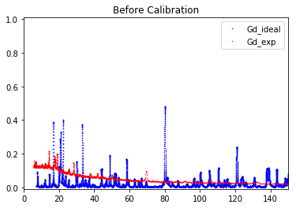
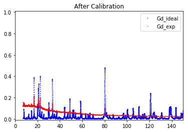
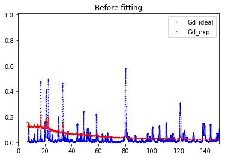
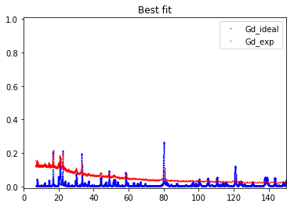

********
Tutorial
********
.. code:: ipython3

    import os
    import sys
    root_folder = os.path.dirname(os.getcwd())
    sys.path.append(root_folder)
    import ResoFit
    from ResoFit.calibration import Calibration
    from ResoFit.fitresonance import FitResonance
    import numpy as np

**Global paramters** - min energy of **7 eV** (has to be greater than
**1 x 10-5 eV**) - max energy of **150 eV** (has to be less than **3000
eV**) - energy steps to interpolate database: **0.1 eV**

.. code:: ipython3

    # Global parameters
    energy_min = 7
    energy_max = 150
    energy_step = 0.01

**File locations for calibriation and resonance fitting**

-  \*/data (directory to locate the file)
-  data\_file (YOUR\_DATA\_FILE.txt or .csv)
-  spectra\_file (YOUR\_SPECTRA\_FILE.txt or .csv)

.. code:: ipython3

    folder = 'data'
    data_file = 'all_thin.txt'
    spectra_file = 'Image002_Spectra.txt'

**Sample info**

-  **Gd** foil
-  **thickness** neutron path within the sample in (**mm**)
-  **density** sample density in (**g/cm3**), if omitted, pure solid
   density will be used in fitting
-  **repeat** : reptition number if the data is summed of multiple runs
   (**default: 1**)

.. code:: ipython3

    layer_1 = 'Gd'
    thickness_1 = 0.15  # mm
    density_1 = np.NaN #g/cm^3 (if omitted, pure solid density will be used in fitting)
    repeat = 5 

**Estimated intrumetal parameters**

-  input estimated **source to detector distance** (**m**)
-  input estimated possible **time offset** in spectra file (**us**)

.. code:: ipython3

    source_to_detector_m = 16.
    offset_us = 0

**Calibration initialization**

-  Pass all the parameters definded above into the Calibration()

.. code:: ipython3

    calibration = Calibration(data_file=data_file,
                              spectra_file=spectra_file,
                              layer_1=layer_1,
                              thickness_1=thickness_1,
                              density_1=np.NaN,
                              energy_min=energy_min,
                              energy_max=energy_max,
                              energy_step=energy_step,
                              repeat=repeat,
                              folder=folder)

**Equations for (time<->wavelength<->energy) conversions**

.. math:: E = \frac{{81.787}}{{{\lambda ^2}}}

*E* : energy in meV,

*λ* : wavelength in (Å).

.. math:: \lambda  = 0.3956\frac{{{t_{record}} + {t_{offset}}}}{L}

*trecord* : recorded time in (µs),

*toffset* : recorded time offset in (µs),

*L* : source to detector distance in (cm).

**Calibrate instrument parameters** - using **source\_to\_detector\_m**
or **offset\_us** or **both** to minimize the difference between the
measured resonance signals and the simulated resonance signals from
*ImagingReso* within the range specified in **global parameters** -
**vary** can be one of **['source\_to\_detector', 'offset', 'all']**
(default is **'all'**) - fitting parameters are displayed

.. code:: ipython3

    calibration.calibrate(source_to_detector_m=source_to_detector_m,
                          offset_us=offset_us,
                          vary='all')

.. parsed-literal::

    Name                     Value      Min      Max   Stderr     Vary     Expr Brute_Step
    offset_us                2.784     -inf      inf  0.06226     True     None     None
    source_to_detector_m     16.45     -inf      inf 0.005113     True     None     None

.. parsed-literal::

    <lmfit.minimizer.MinimizerResult at 0x1129bf278>

**Retrieve calibrated instrument parameters**

.. code:: ipython3

    calibration.calibrated_offset_us

.. parsed-literal::

    2.7844490583292183

.. code:: ipython3

    calibration.calibrated_source_to_detector_m

.. parsed-literal::

    16.452438260036192

**Plot calibration result**

-  using the best fitted **source\_to\_detector\_m** and **offset\_us**
   to show the calibrated resonance signals from measured data and the
   expected resonance positions from *ImagingReso*
-  measured data before and after is ploted with raw data points instead
   of interpolated data points. However, the interpolated data was used
   during the calibration step above.

.. code:: ipython3

    calibration.plot_before()
    calibration.plot_after()

**Resonance Fitting**

**Fitting initialization**

-  Pass all the parameters definded and calibrated into the
   FitResonance()

.. code:: ipython3

    fit = FitResonance(spectra_file=spectra_file,
                       data_file=data_file,
                       layer=layer_1,
                       repeat=repeat,
                       energy_min=energy_min,
                       energy_max=energy_max,
                       energy_step=energy_step,
                       calibrated_offset_us=calibration.calibrated_offset_us,
                       calibrated_source_to_detector_m=calibration.calibrated_source_to_detector_m)

**Fitting equations** - Beer-Lambert Law:

.. math:: T\left( E \right) =\frac { I\left( E \right)  }{ { I }_{ 0 }\left( E \right)  } =exp\left[ -\sum\nolimits_i { { N }_{ i }{ d }_{ i } } \sum\nolimits_j { { \sigma  }_{ ij }\left( E \right) { A }_{ ij } }  \right]

*Ni* : number of atoms per unit volume of element *i*,

*di* : effective thickness along the neutron path of element \ *i*,

*σij*\ (E) : energy-dependent neutron total cross-section for the
isotope *j* of element *i*,

*Aij* : abundance for the isotope *j* of element *i*.

.. math:: {N_i} = {N_A}{C_i} = \frac{{{N_A}{\rho _i}}}{{\sum\nolimits_j {{m_{ij}}{A_{ij}}} }}

*NA* : Avogadro’s number,

*Ci* : molar concentration of element \ *i*,

*ρi* : density of the element *i*,

*mij* : atomic mass values for the isotope *j* of element *i*.

**How to fit the resonance signals**

-  using **thickness** (mm) or **density** (g/cm3) to minimize the
   difference between the measured resonance signals and the simulated
   resonance signals from *ImagingReso* within the range specified in
   **global parameters**
-  **vary** can be one of **['thickness', 'density']** (default is
   **'density'**)
-  fitting parameters are displayed

.. code:: ipython3

    fit.fit(thickness=thickness_1, density=density_1, vary='density')

.. parsed-literal::

    Name          Value      Min      Max   Stderr     Vary     Expr Brute_Step
    density       3.695        0      inf  0.04374     True     None     None
    thickness      0.15        0      inf        0    False     None     None

.. parsed-literal::

    <lmfit.minimizer.MinimizerResult at 0x11210c198>

**Output fitted density in terms of molar concentration**

-  unit: mol/cm3

.. code:: ipython3

    fit.molar_conc(layer_1)

.. parsed-literal::

    Molar conc. of element Gd in layer Gd is: 0.02350014075607628 (mol/cm3)

.. parsed-literal::

    0.023500140756076281

**Plot fitting result**

-  using the best fitted **density** to show the measured resonance
   signals and the fitted resonance signals from *ImagingReso*
-  measured data before and after is ploted with raw data points instead
   of interpolated data points. However, the interpolated data was used
   during the fitting step above.

.. code:: ipython3

    fit.plot_before()
    fit.plot_after()

